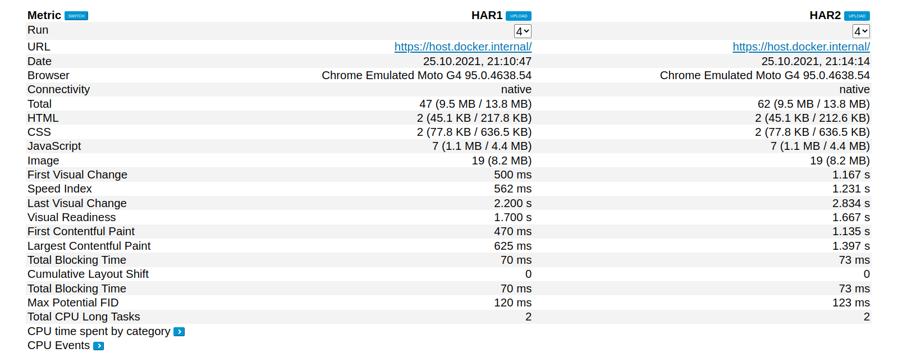
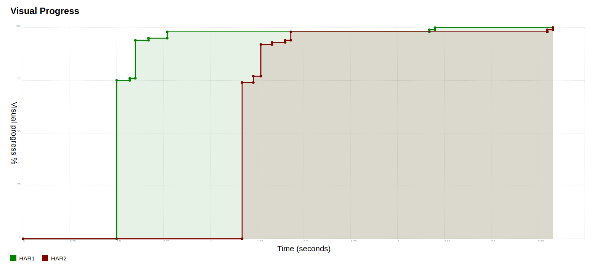

### Шаг 1. Сертификат для локального HTTPS

Настроил SSL для localhost с помощью mkcert

### Шаг 2. NGinx как reverse-proxy

Обновил Nginx, дописал настройки для localhost, браузер открывет `https://localhost`

### Шаг 3. Настроить HTTP/2 и server-push

Добавил настройки из ридми, все работает

### Шаг 4. Поэксперементировать с HTTP/2 server-push

- Указанные картинки подключил через `image_tag`
- Добавил `server-push`
- 
- Все работает

### Шаг 5. Измерение эффекта сделанных изменений

- visual progress начинает заполняться раньше при использовании server-push. Особенно это заметно на четвертом прогоне
- Waterfall показывает, что запушенные svg переместились в самое начало загрузки.

