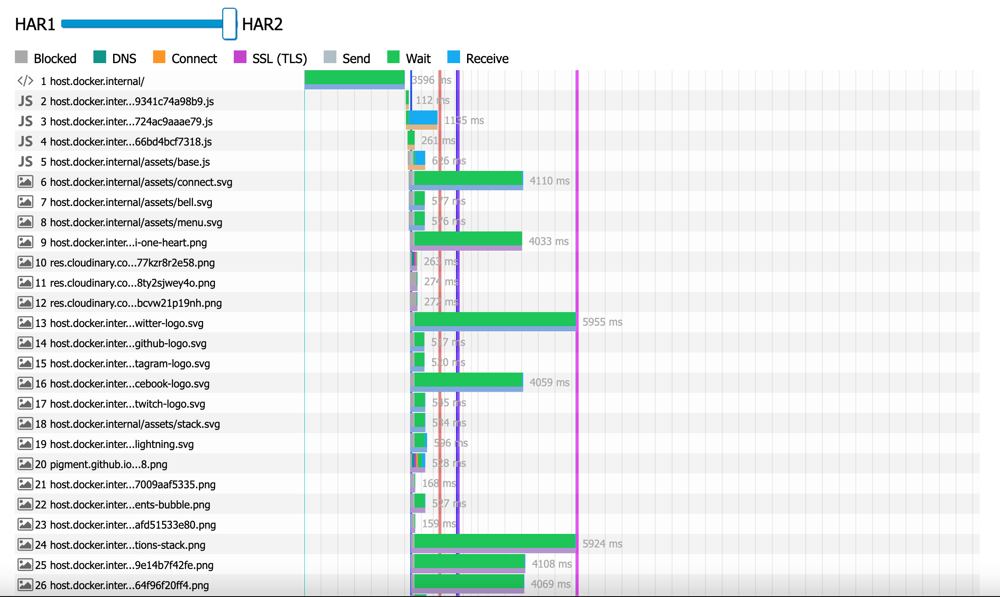
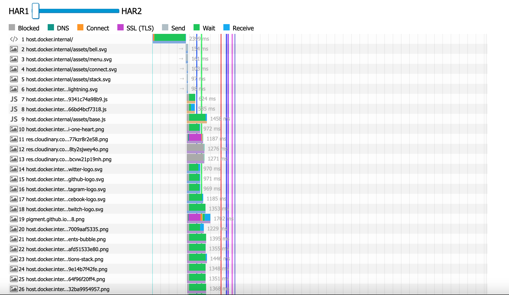

# HW5

### Шаг 1. Настроить сертификат для локального HTTPS

Создал сертификат для `localhost`.

### Шаг 2. Настраиваем NGinx как reverse-proxy

Установил `NGinx`, добавил ssl в конфиг.

### Шаг 3. Настроить HTTP/2 и server-push

Добавил `HTTP/2` + `push_preload` в конфиг.

### Шаг 4. Поэксперементировать с HTTP/2 server-push

Видно, что заинлайненные картинки появляются сразу вместе с первым контентом - шапкой, спустя небольшое заметное время на медленном соединении. Остальные картинки догружаются постепенно уже после.

Настроил `server-push`, теперь в dev tools видно, что инициатор загрузки картинок - `Push/Other`.

### Шаг 5. Измерение эффекта сделанных изменений

**Без `server-push`:**

**С `server-push`:**

Первая отрисовка при `server-push` появляется почти на секунду (~27%) быстрее, что в принципе крутой результат, учитывая небольшие затраты времени на оптимизацию.

Единственное - сначала напряг показатель Total Blocking Time: 1.988s с сервер пуш и 549ms без сервер пуш, но пересмотрев еще несколько итераций оказалось, что показатель сильно плавает и нельзя однозначно сказать, что он ухудшился при использовании `server-push`.
