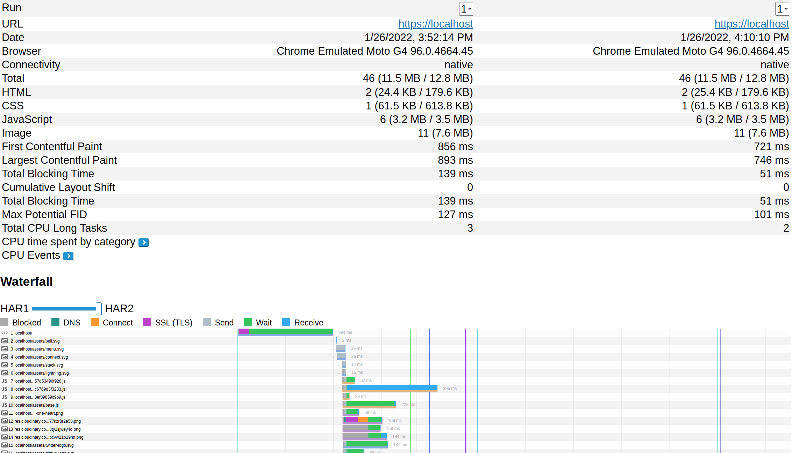
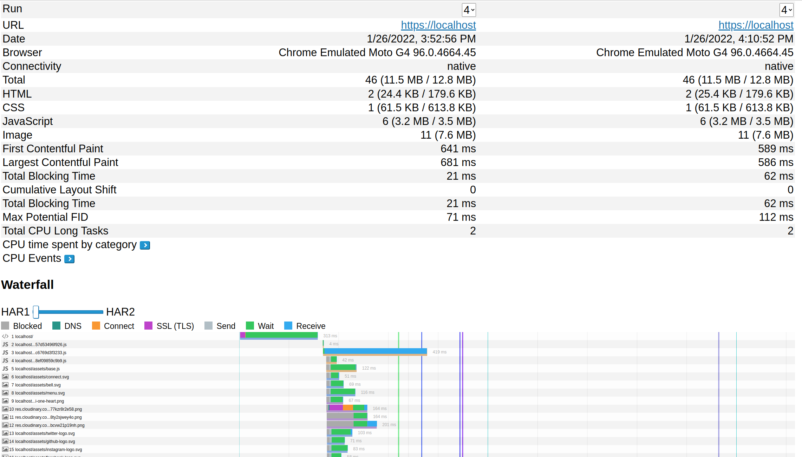

1. Установил `mkcert`
2. Установил `NGinx`, настроил `ssl`
3. Настроил `HTTP/2` и `server-push`
4. Провел эксперементы
5. Измерение без server-push
6. Измерение с server-push

- на Waterfall можно видеть, что server-push картинки отправляются в самую первую очередь, поэтому они отображаются быстрые и в браузере, что будет положительно сказываться на восприятие сайта пользователем
