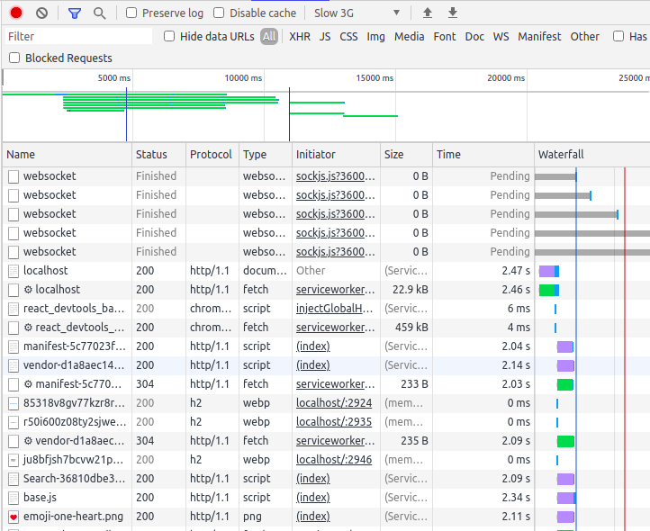
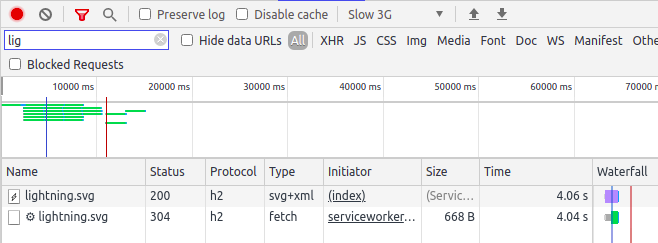
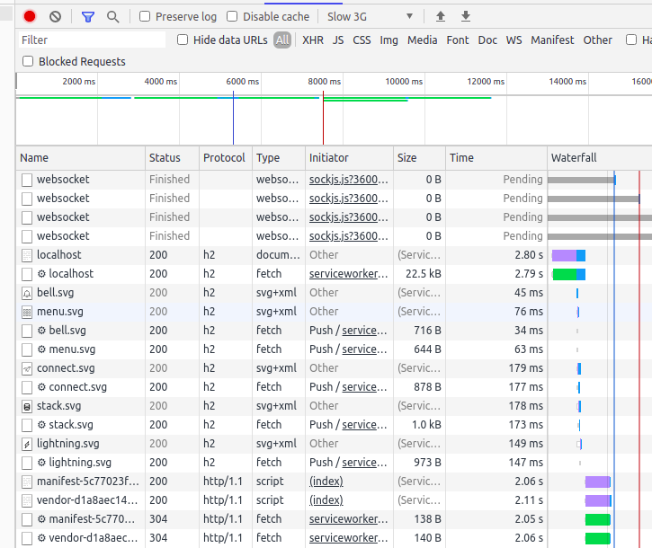

# Задание № 5

### Шаг 1. Настроить сертификат для локального HTTPS

Сгенерировал локальный сертификат с помощью `mkcert`.

### Шаг 2. Настраиваем NGinx как reverse-proxy

Сделал запуск nginx из docker-контейнера.

### Шаг 3. Настроить HTTP/2 и server-push

Сделал соответствующие настройки в `nginx/localhost.conf`

### Шаг 4. Поэксперементировать с HTTP/2 server-push

Загрузка страницы до включения server-push:

Загрузка страницы после включения server-push:

