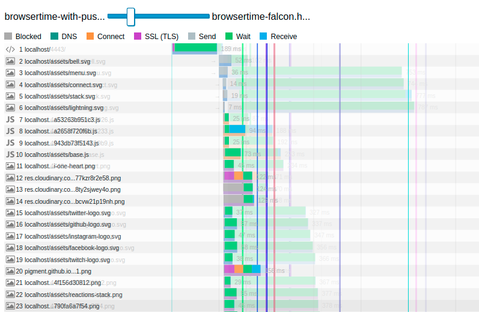

# Задание №5

## Чеклист для сдачи задания

- [x] Реализация `server-push` для указанных в задании картинок
- [x] Конфиг `NGinx`
- [x] Ссылка на сравнение `HAR`-файлов с `server-push` и без
- [x] Бонус 1 про `dev.to`
- [x] Бонус 2 про `Falcon`

## Установка и настройка nginx

Для того, чтобы не засорять хостовую систему, `nginx` становлен через
docker-контейнер, все относящееся к его запуску располагается в
`vendor/nginx`. `compose`-файл, которым можно воспользоваться для
запуска, также находится в этой папке.

Само приложение засечательно поддерживает HTTPS "из коробки",
поэтому его подстройки не потребовалось.

## Шаг 1. Настроить сертификат для локального HTTPS

Сертефикат генерируется, например, через предложенный `mkcert`.
Файлы сертификата и ключа находятся в
`vendor/nginx/cert/localhost.{pem,key}`.

## Шаг 2. Настраиваем NGinx как reverse-proxy

Настраивается через `proxy_pass`.

Конфигурация `nginx` пробрасывается в контейнер, находится в файле
`vendor/nginx/conf.d/localhost.conf`.

## Шаг 3. Настроить HTTP/2 и server-push

Достигается подстройкой конфига `nginx` и выставлением заголовков в
приложении Rails.

Проверка через `http2-push-detect` (раньше с этой утилитой не
сталкивался) показывает, что все включилось:

```
$ http2-push-detect https://localhost
Receiving pushed resource: /assets/bell.svg
Receiving pushed resource: /assets/menu.svg
Receiving pushed resource: /assets/connect.svg
Receiving pushed resource: /assets/stack.svg
Receiving pushed resource: /assets/lightning.svg
```

## Шаг 4. Поэксперементировать с HTTP/2 server-push

Предварительно видно, что время загрузки страницы при включении пушей сокращается.

График загрузки в devtools по включения server-push:


...и после:


## Шаг 5. Измерение эффекта сделанных изменений

HAR-файлы без server-push и с ним находится в папке `report`, называются `browsertime-no-push.har` и `browsertime-with-push.har` соответственно.

Я не нашел, как сделать шеринг результатов сравнения, страница формируется динамически, поэтому отмечу основные моменты:

- Общее сравнение показвает, что показатели скорости с пушем лучше,
  чем без него:
  
- На "Waterfall" видна разница в загрузке картинок, они
  переместились в начало. Кроме этого, также видно разницу в
  скорости и другой порядок загрузки:
  
  

Сравнение полностью сохранено в виде HTML-страницы в
`report/5_13_2021, 6_04_20 PM vs 5_13_2021, 4_26_31 PM.html`.

## Bonus 1. Аудит dev.to

По WebPageTest видно, что dev.to стал хорошо проработанным
проектом с хорошо отстроеной веб-оптимизацией отдачи контента.
gzip включен где он нужен, кеширование настроено. Практически,
все оценки "100 из 100".

С чем можно поработать -- так это с форматами картинок,
по ним все выглядит уже не так хорошо. Можно поджать статику
на более оптимальные форматы, подогнать геометрический размер
изображений, настроить процессинг изображений пользователей
при загрузке также на более оптимальный формат.

Еще в глаза бросается долгое время установки SSL-соединения с
Cloudinary, но это проблема относится, скорее, с CDN-у. Если
это надо соптимизировать, то можно предложить, разве что,
сменить CDN.

А, в отсальном, здесь сложно найти что-то явно бросающееся
в глаза, для дальнейшей оптимизации здесь нужно уже работать
на уровне кода -- повышать эффективность JS и/или приложения.

## Bonus 2. Falcon HTTP/2

`Falcon` настроен на порту `4443`, работает по HTTPS/2 с
поддержкой server-push. server-push включен в полу-костыльном
виде через middleware прямо в `application.rb`, чисто для
прогона бенчмарка, включает пуш только для рассматриваемых
картнок и только на главной странице. Если обновить Rails хотя
бы до 5.2, то там в `ActionDispatch` уже встроена поддержка
early hints и настройка HTTP/2 была бы поаккуратнее.

`http2-push-detect` подтверждает, что server push отрабатывается.

`В целом, на мой взгляд, исключить балансер и отдавать всё с
помощью сервера приложений -- не очень хорошая идея, хотя бы,
потому что ассеты будет также раздавать аппсервер. Но, возможно
апстрим, работающий по HTTP/2 -- не такая плохая идея. Я бы
выяснял целесообразность такой миграции по нагрузочным тестам,
анализируя как сетевую нагрузку, так и затраты на процессор и
память -- как минимум, мы будем иметь не только другой сервер
приложений, но еще и сжатие HTTP/2.

Сам `Falcon` не выглядит сильно законченным, обертки для early
hints у него присутствуют в ветке `development`, видно, что
работа еще ведется.

Текущий способ требует немного магии для получения удобного к
использованию из Rails относительно универсального решения.

Метрики sitespeed.io, мягко говоря, удручают:

- First Paint: 2.582 s (4.300 s)
- Fully Loaded: 3.820 s (5.513 s)
- Last Visual: Change 3.067 s (5.000 s)

Но разглядывая Waterfall видно, что картинки, для которых
используется пуш, грузятся значительное время, что может быть
объясено тем, что Falcon гораздо хуже отдает статику. Хотя,
видно, что картинки находятся в начале загрузки
(данные Falcon здесь отображены бледно):



Да, стоило отдать статику nginx-ом, и сделать его реверс-прокси
и в случае с Falcon, тогда бы можно было бы сравнивать
эффективность его работы как сервера приложений. Однако, тогда
не получилось бы посмотреть полностью его возможности в части
HTTP/2.

Сам HTML главной страницы отдается лишь чуть дольше. Но, все же,
дольше, чем в случае с Puma.

Можно сделать вывод, что нет смысла в использовании Falcon в
продакшен-среде проектов из-за сырости решения, слабой
документации и отсутствии выигрыша по производительности по
сравнению с Puma.
