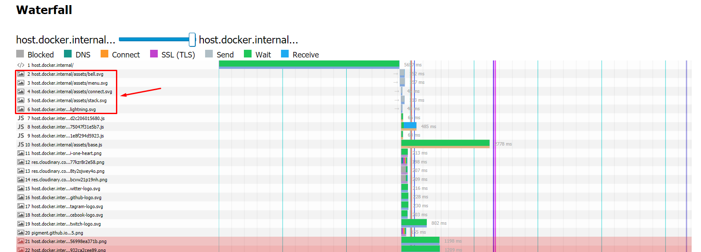

# Case Study

### Шаг 1. Настроить сертификат для локального HTTPS

Воспользовался `mkcert`, проблем не возникло.

### Шаг 2. Настраиваем NGinx как reverse-proxy

Запуситл `nginx` из контейнера, добавил конфиг из задания. Без проблем.

Браузер успешно открыл `https://localhost`

### Шаг 3. Настроить HTTP/2 и server-push

Дополнил конфиг `NGinx` поддержкой `HTTP/2` и `server-push`

### Шаг 4. Поэксперементировать с HTTP/2 server-push

До `server-push`

После `server-push`

### Шаг 5. Измерение эффекта сделанных изменений

Сравнил вариант с `server-push` и с обычными картинками без инлайнинга и без пуша.

Для этого воспользовался `sitespeed.io`

#### 5.1 Анализ без `server-push`

[HAR](cs_docs/host.docker.internal_-chrome-5.1-2021-09-14150709.har)

#### 5.2. Анализ с `server-push`

[HAR](cs_docs/host.docker.internal_-chrome-5.2-2021-09-14152335.har)

#### 5.3 Сравнение результатов

Сравнил два полученных `HAR`-файла с помощью https://compare.sitespeed.io/

Инструмент понравился, интересный, планирую использовать в работе.

**Waterfall - картинки отправляются в первую очередь**

\*не понял как создать ссылку на сравнение файлов, поэтому закинул только скрин.
