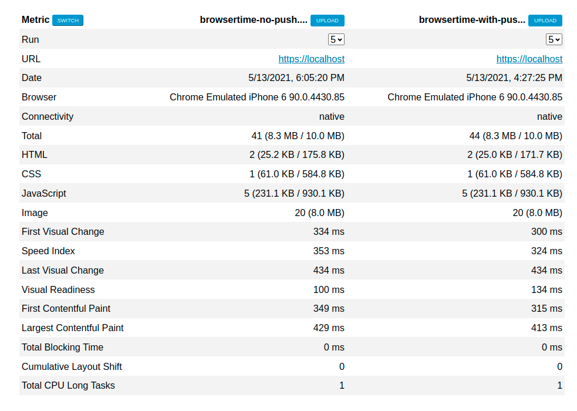
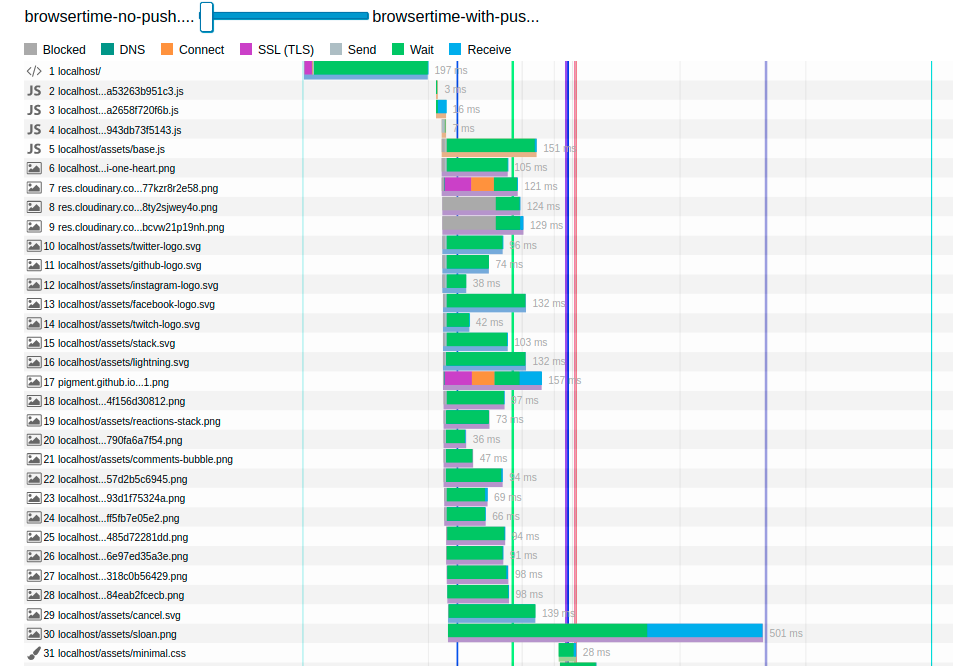
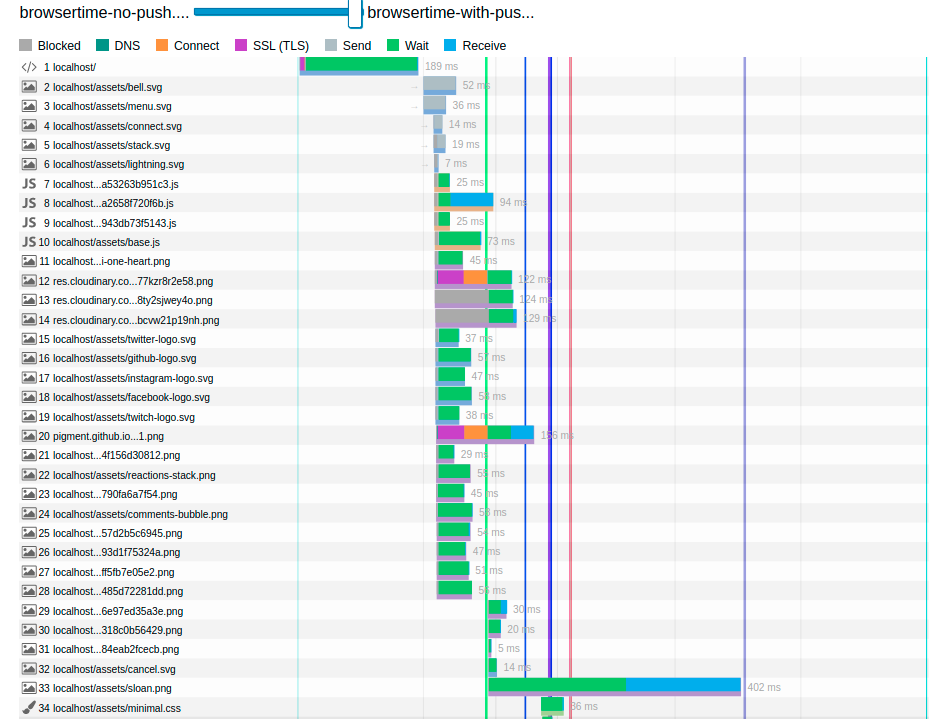

# Задание №5

## Чеклист для сдачи задания

- [x] Реализация `server-push` для указанных в задании картинок
- [x] Конфиг `NGinx`
- [ ] Ссылка на сравнение `HAR`-файлов с `server-push` и без
- [ ] Бонус 1 про `dev.to`
- [ ] Бонус 2 про `Falcon`

## Установка и настройка nginx

Для того, чтобы не засорять хостовую систему, `nginx` становлен через
docker-контейнер, все относящееся к его запуску располагается в
`vendor/nginx`. `compose`-файл, которым можно воспользоваться для
запуска, также находится в этой папке.

Само приложение засечательно поддерживает HTTPS "из коробки",
поэтому его подстройки не потребовалось.

## Шаг 1. Настроить сертификат для локального HTTPS

Сертефикат генерируется, например, через предложенный `mkcerts`.
Файлы сертификата и ключа находятся в
`vendor/nginx/cert/localhost.{pem,key}`.

## Шаг 2. Настраиваем NGinx как reverse-proxy

Настраивается через `proxy_pass`.

Конфигурация `nginx` пробрасывается в контейнер, находится в файле
`vendor/nginx/conf.d/localhost.conf`.

## Шаг 3. Настроить HTTP/2 и server-push

Достигается подстройкой конфига `nginx` и выставлением заголовков в
приложении Rails.

Проверка через `http2-push-detect` (раньше с этой утилитой не
сталкивался) показывает, что все включилось:

```
$ http2-push-detect https://localhost
Receiving pushed resource: /assets/bell.svg
Receiving pushed resource: /assets/menu.svg
Receiving pushed resource: /assets/connect.svg
Receiving pushed resource: /assets/stack.svg
Receiving pushed resource: /assets/lightning.svg
```

## Шаг 4. Поэксперементировать с HTTP/2 server-push

Предварительно видно, что время загрузки страницы при включении пушей сокращается.

График загрузки в devtools по включения server-push:


...и после:


## Шаг 5. Измерение эффекта сделанных изменений

HAR-файлы без server-push и с ним находится в папке `report`, называются `browsertime-no-push.har` и `browsertime-with-push.har` соответственно.

### 5.3 Сравнение результатов

Я не нашел, как сделать шеринг результатов сравнения, страница формируется динамически, поэтому отмечу основные моменты:

- Общее сравнение показвает, что показатели скорости с пушем лучше,
  чем без него:
  
- На "Waterfall" видна разница в загрузке картинок, они
  переместились в начало. Кроме этого, также видно разницу в
  скорости и другой порядок загрузки:
  
  

Сравнение полностью сохранено в виде HTML-страницы в
`report/5_13_2021, 6_04_20 PM vs 5_13_2021, 4_26_31 PM.html`.

## Bonus 1. Аудит dev.to

## Bonus 2. Falcon HTTP/2
