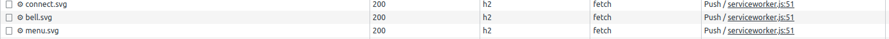

# Case Study

### Шаг 1. Настроить сертификат для локального HTTPS

Настроил сертификат с помощью `mkcert`

### Шаг 2. Настраиваем Nginx как reverse-proxy

Настроил нджинкс, проверил что открывается `https://localhost`

### Шаг 3. Настроить HTTP/2 и server-push

Дополнил конфиг `NGinx` поддержкой `HTTP/2` и `server-push`

### Шаг 4. Поэксперементировать с HTTP/2 server-push

Проделал необходимы манипуляции, запросы к картинкам, указанным в push_headers, теперь выполняются по протоколу `h2`

### Шаг 5. Измерение эффекта сделанных изменений

#### 5.1 Анализ без `server-push`

Сделал анализ без server-push и сохранил отчет without_push.xar

#### 5.2. Анализ с `server-push`

Сделал анализ с server-push и сохранил отчет with_push.xar

#### 5.3 Сравнение результатов

На версии с сервер-пуш First Contentful Paint 482 ms против 1.082 s без сервер-пуша -- заметный прирост
На `Waterfall` видно, что `server-push` картинки отправляются в самую первую очередь.

