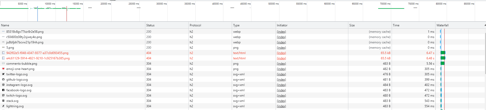
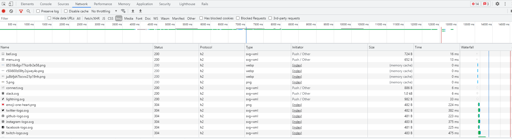

# Case Study

### Шаг 1. Настроить сертификат для локального HTTPS

Воспользовался `mkcert`, проблем не возникло.

### Шаг 2. Настраиваем NGinx как reverse-proxy

Запуситл `nginx` из контейнера, добавил конфиг из задания. Без проблем.

Браузер успешно открыл `https://localhost`

### Шаг 3. Настроить HTTP/2 и server-push

Дополнил конфиг `NGinx` поддержкой `HTTP/2` и `server-push`

### Шаг 4. Поэксперементировать с HTTP/2 server-push

До `server-push`

После `server-push`


### Шаг 5. Измерение эффекта сделанных изменений

Сравним вариант с `server-push` и с обычными картинками без инлайнинга и без пуша.

Для этого воспользуемся `sitespeed.io` (**подробно расскажу об этом мощном инструменте в лекции №6**)

#### 5.1 Анализ без `server-push`

Выполните анализ версии без `server-push` и без `inline`:

```
docker run --rm -v "$(pwd)":/sitespeed.io sitespeedio/sitespeed.io --mobile -n 5 --preUrl https://host.docker.internal/ https://host.docker.internal/

# --mobile - мобильный вид
# -n 5 - 5 повторов
# --preUrl https://host.docker.internal/ - урл, первого захода
# https://host.docker.internal/ - урл повтороного захода, который и анализируем
# а вообще https://host.docker.internal/ - это https://localhost, на котором стоит ваш локальный `HTTP/2-proxy` с точки зрения `docker`.
```

Откройте сгенерированный отчёт `sitespeed.io`, зайдите на вкладку `Pages`, там провалитесь в отчёт по единственной странице, и внизу воспользуйтесь кнопкой `DOWNLOAD HAR` - сохраните `HAR`-файл, закомиттьте его.

#### 5.2. Анализ с `server-push`

Сделайте то же, что в пункте `5.1`, но с версией, где устанавливаются заголовки `server-push`. Сохраните `HAR`-файл, закомиттьте его.

#### 5.3 Сравнение результатов

Сравните два полученных `HAR`-файла с помощью https://compare.sitespeed.io/

**Обязательно добавьте ссылку на сравнение в описание `PR`**

Вы должны увидеть на `Waterfall`, что `server-push` картинки отправляются в самую первую очередь.

На `filmstrip` и `video` также можно увидеть, что `server-push` картинки действительно появляются заметно раньше.
